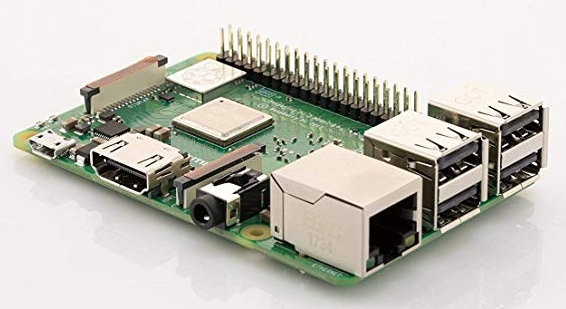

# peariscope
Computer vision project for FIRST Robotics Team #5414 Pearadox.

## Bill of Materials

### Element14 Raspberry Pi 3 B+ Motherboard
$36.98

### Samsung 32GB 95MB/s (U1) MicroSDHC EVO Select Memory Card with Adapter (MB-ME32GA/AM)
$7.49

### Miuzei Raspberry Pi 3 B+ Case with Fan Cooling and 3× Heat-Sinks, 5V 2.5A Power Supply with On/Off Switch Cable for RPi 3 B+, 3B, 2b
$15.99

### MakerFocus Raspberry Pi Camera Night Vision Camera Adjustable-Focus Module 5MP OV5647 Webcam Video 1080p and 15CM 50CM FFC Adapter Cables and Camera Mount
$23.99

