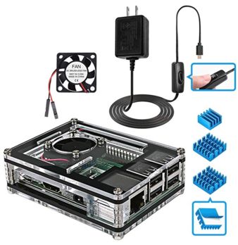
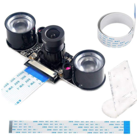

# Peariscope Hardware

The following hardware was used to build a prototype unit and is available on Amazon.  

## Element14 Raspberry Pi 3 B+ Motherboard

$36.98  

- 1.4GHz 64-bit quad-core ARMv8 CPU, 1 GB RAM
- 802.11n Wireless LAN, 10/100Mbps Lan Speed
- Bluetooth 4.2, Bluetooth Low Energy
- 4 USB ports, 40 GPIO pins, Full HDMI port, Combined 3.5mm audio jack and composite video
- Camera interface (CSI), Display interface (DSI), Micro SD card slot, VideoCore IV 3D graphics core

## Samsung 32GB 95MB/s (U1) MicroSDHC EVO Select Memory Card with Adapter (MB-ME32GA/AM)

$7.49  

- Up to 100MB/s read and 20MB/s write speeds; UHS Speed Class U1 and Speed Class 10
- Water proof, Shock proof, Temperature proof, X ray proof, Magnetic proof

## Miuzei Raspberry Pi 3 B+ Case with Fan Cooling and 3× Heat-Sinks, 5V 2.5A Power Supply with On/Off Switch Cable for RPi 3 B+, 3B, 2b

$15.99  

- Case has the layout for the Raspberry Pi 3 model B+
- Made of acrylic so won’t block Wifi / Bluetooth signal
- Plugs on the case to connect GPIO, HDMI, USB, SD, power, etc
- Mini fan and 3 heatsinks for cooling CPU/ROM/RAM
- Power supply (2.5A) with on/off switch on the 1.5m long cable

## MakerFocus Raspberry Pi Camera Night Vision Camera Adjustable-Focus Module 5MP OV5647 Webcam Video 1080p and 15CM 50CM FFC Adapter Cables and Camera Mount

$23.99  

- Kit includes camera, two fill lights, FFC adapters (15cm and 50cm), and camera mount (acrylic)
- Camera supports night vision and has manual focus
- Camera provides 3.3V power output

Note:

- The LED lights always turn on no matter if the camera is turned on or not
- The lights will warm up (generally 40℃ to 50℃) when they are working
- The micro adjustable resistor (beside the lights) can turn down the lights to lower temperatures
