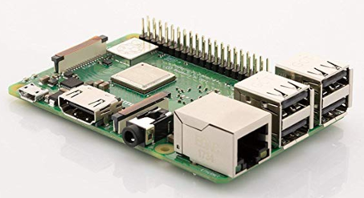
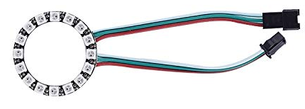

# Peariscope Hardware

The following hardware was used to build the prototype unit and is available on Amazon and/or Adafruit.  

## Element14 Raspberry Pi 3 B+ Motherboard

$36.98  

- 1.4GHz 64-bit quad-core ARMv8 CPU, 1 GB RAM
- 802.11n Wireless LAN, 10/100Mbps LAN Speed
- Bluetooth 4.2, Bluetooth Low Energy (BLE)
- 4 USB ports, 40 GPIO pins, Full HDMI port, Combined 3.5mm audio jack and composite video
- Camera interface (CSI), Display interface (DSI), Micro SD card slot, VideoCore IV 3D graphics core

## Samsung 32GB 95MB/s (U1) MicroSDHC EVO Select Memory Card with Adapter (MB-ME32GA/AM)

$7.49  

- Up to 100MB/s read and 20MB/s write speeds; UHS Speed Class U1 and Speed Class 10
- Water proof, Shock proof, Temperature proof, X-ray proof, Magnetic proof

## Raspberry Pi 3 b+ Case, iUniker Raspberry Pi 3 Model B+ Transparent Case with Raspberry Pi Heatsink for Raspberry Pi 3B+, 3B, 2B

$6.49  

- This clear protective case is designed specifically for the Raspberry Pi 3 Model B+, 3B, 2B
- The case is a made of ABS that snaps together around the Raspberry Pi
- It provides protection and accessibility for the Raspberry Pi
- Wall mountable. Access to all ports. For New Raspberry Pi 3 B+.
- Comes with 2 pcs Heatsink

## 5MP 1080P Video Camera Module for Raspberry Pi 4 Model B, Pi 3 b+, Pi Zero W Camera with Case Flex Cable (Camera + Holder)

$11.99  

- Compatible with Raspberry Pi 4 Model B, Pi 3 Model b+, Pi 3b, Pi Zero, Pi Zero Wireless
- 5 Megapixel sensor with OV5647 webcam sensor in a fixed-focus lens
- The camera is capable of 2592 x 1944 pixel static images, and also supports 1080p/30 fps, 720p/ 60fps and 640 x480p 60/90 video recording
- Specially designed clear acrylic case to protect camera module

## CHINLY 2pcs 16 Leds WS2812B WS2812 5050 RGB LED Pixel Ring Lamp Light Individually Addressable Full Dream Color DC5V

$11.99  

- LED Chip: WS2812B SMD5050 RGB LED
- Voltage: DC5V
- 16 Leds WS2812B Lamp Light with Integrated Driver
- The interface of 5V+, GND and DI of each ring is soldered in the factory
- Wide compatibility, works great with Arduino, Raspberry Pi, FastLED library, Rainbowduino, SP103E, SP105E, K1000C, T1000S, etc.

## 74AHCT125 - Quad Level-Shifter (3V to 5V)

$1.50

- Level shifting chips let you connect 3V and 5V devices together safely
- Current Output: 8mA
- Voltage Supply: 4.5 V ~ 5.5 V
- Operating Temperature: -40ºC ~ 125ºC

